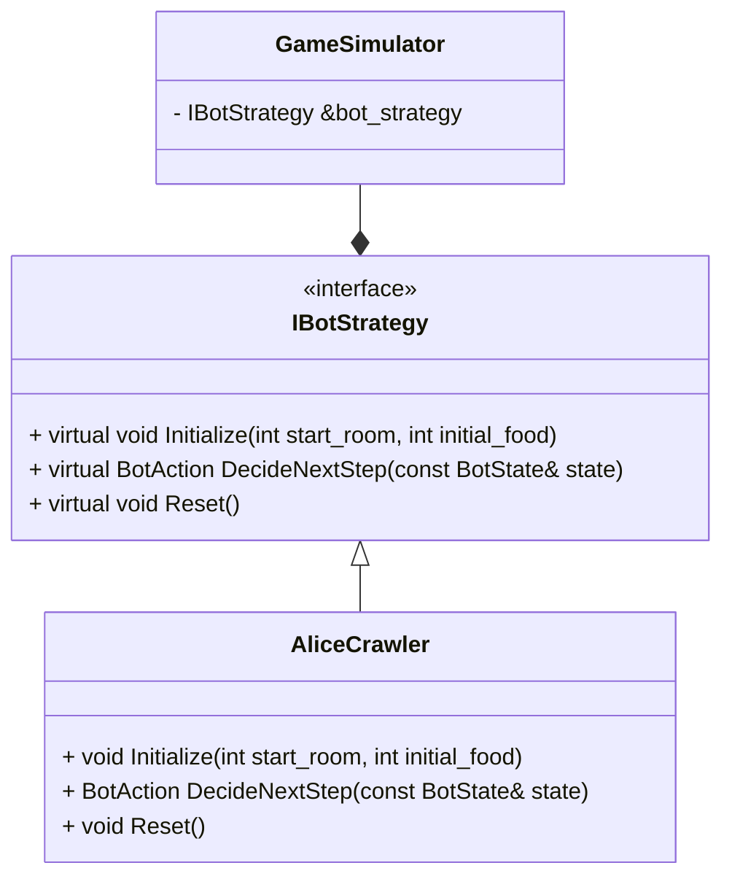

#### Environment: 
- OS: Arch Linux 6.9.13
- Compiler: GCC
- Standart: C++20
- Build system: CMake

Запуск осуществляется как ```app <input_file>```

IBotStrategy используется как интерфейс для удобной смены стратегий симуляции прохода бота по подемелью. AliceCrawler - реализованная стратегия прохода по подземелью, выполненная в соответствии с "Алгоритмом Алисы" из задания.

