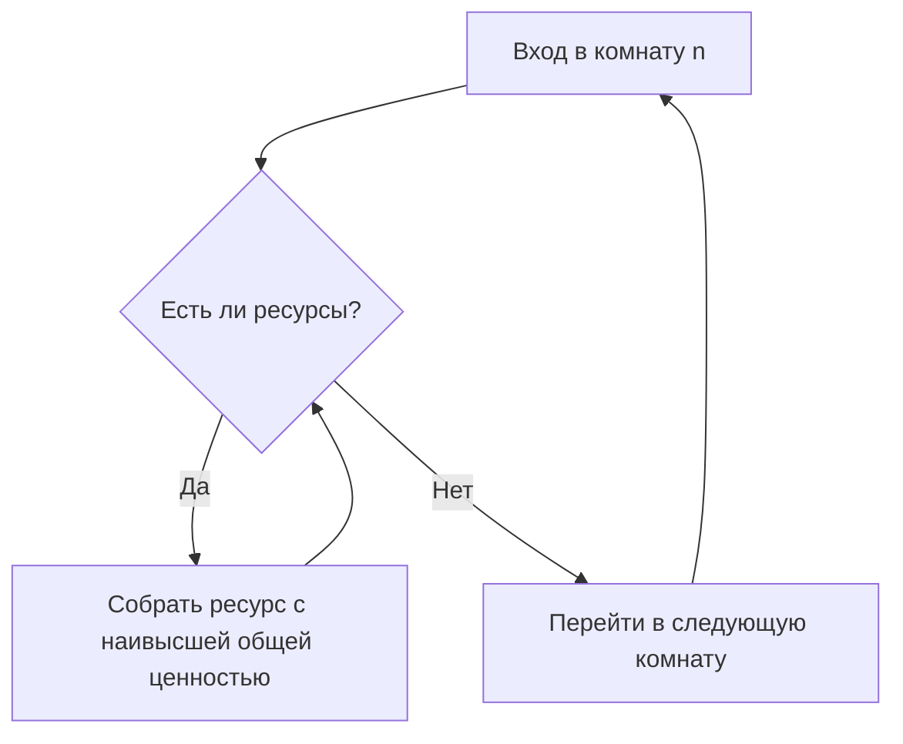

# [RU] Рекомендации по улучшению

## Анализ заданных алгоритмов
Исходный алгоритм использует жадную стратегию исследования: на каждом шаге выбирается смежная непосещённая комната с наименьшим номером; если таких нет - ближайшая непосещённая комната ищется через BFS. Для возврата используется BFS по известным посещённым комнатам.

#### Важные Нюансы:
1. _Жадный выбор ресурсов_: Текущая стратегия поиска ориентируется на наивысшую локальную ценность (алгоритм никак не отслеживает ресурсы вне текущей комнаты сбора), что ограничивает обнаружение оптимальных ресурсных маршрутов глобально.
2. _Строгая блокировка лимита пути_: Еда используется ровно на 50%, а затем бот разворачивается и идёт по кратчайшему пути к точке старта, используя излишки для сбора первых попавшихся ресурсов; теоретически может быть исход, когда выгоднее потратить больше 50% еды в незнакомых комнатах, которые ближе к выходу, чтобы бесплатно собирать ресурсы или, в ином случае, заложить определённое количество еды на сбор ресурсов на обратном пути.

## Предложения по улучшению
#### Динамическая оценка рисков
В настоящем алгоритме риск полностью нивелируется правилом спуска на менее чем 50% пищи. Это не всегда оптимально ввиду неравномерного распределения ресурсов по комнатам.

Динамическая оценка рисков позволяет за счёт внешнего задания параметра риска/защиты (перерасхода/экономии еды соответственно) ввести:
1. Поздний выход: вероятный случай смерти бота при нехватке еды за счёт потенциального роста получаемых ресурсов за бесплатное исследование комнат;
2. Ранний выход: сбор большего количества ресурсов на обратном пути ввиду переизбытка еды
_Плюсы_:
- Возможность задать единицу оценки риска: насколько бот сможет отступить от изначального плана трат 50/50 либо ради захвата большего количества комнат, либо ради сбора большего количества ресурсов за счёт избытка еды
- Прирост выгоды за счёт увеличения количества собираемых ресурсов

_Минусы_:
- Практически нулевой бонус, если использовать поздний выход в текущем алгоритме ввиду его исполнения как жадного выборщика. Соответственно положительный эффект может показать только при совместном использовании с иными доработками
- Если использовать ранний выход - более выгодные помещения могут быть недоисследованы

#### Глобальная оценка ресурсов пути
В настоящем алгоритме при возврате ресурсы собираются последовательно, то есть при избытке еды:

При глобальной оценке пути предлагается собирать ценности посещённых комнат и оценивать путь целиком, чтобы тратить остатки пищи на самые ценные ресурсы на пути.

_Плюсы_:
- Повышение ценности выходных ресурсов
- Минимальные требуемые изменения

_Минусы_:
- Необходимы дополнительные накладные расходы на динамическую оценку выгоды

#### Эвристическая оценка распределения
В данный момент исследование происходит по правилу "левой руки": обходится самая левая ветка, после упора в тупик ищется ближайшее разветвление и берется следующая по порядку левая ветвь.

В играх используются различные методы процедурной генерации: шумы, распределения, веса и т.д. В зависимости от используемого метода распределения ресурсы могут группироваться в кластеры: соответственно можно попробовать эвристически оценить веса комнат, относительно количества ресурсов в известных комнатах. В рамках такой логики наихудшая ситуация -> идеально равномерное распределение по всем комнатам, так как в таком случае все алгоритмы по извлекаемой выгоде будут равны DFS.

Для относительно простой реализации можно задавать веса неизвестных видимых комнат за счёт примерного вычисления "богатства" комнат. Известные комнаты позволяют пересчитывать результат, неизвестные же примерно оцениваются по соседним известным, характеризуясь дальностью от "богатых" соседей: следует рассчитывать вес как совместную плотность распределения ресурсов по смежным видимым комнатам.

_Плюсы_:
- Значительный прирост выгоды в лучшем случае и отсутствие потери выгоды в худшем
- Возможность применения различных эвристик для корректировки под конкретную игровую модель

_Минусы_:
- Необходима значительная переработка алгоритма
- Усложнение алгоритма как такового

_Ресурсы о процедурной генерации в видеоиграх_:
1. https://ceur-ws.org/Vol-3917/paper21.pdf
2. https://graphics.tudelft.nl/~rafa/myPapers/bidarra.TCIAIG.2014.pdf
3. https://www.gamedeveloper.com/design/procedurally-generating-enemies-places-and-loot-in-i-state-of-decay-2-i-
4. https://gamedev.stackexchange.com/questions/148685/how-do-you-go-about-distributing-resources-procedurally-in-a-game

|Улучшение|Сложность реализации|Ожидаемый прирост выгоды|
|-|-|-|
|Динамическая оценка рисков|Минимальная|В общем случае небольшой|
|Глобальная оценка ресурсов пути|Низкая|Средний|
|Эвристическая оценка распределения|Средняя|Высокий|